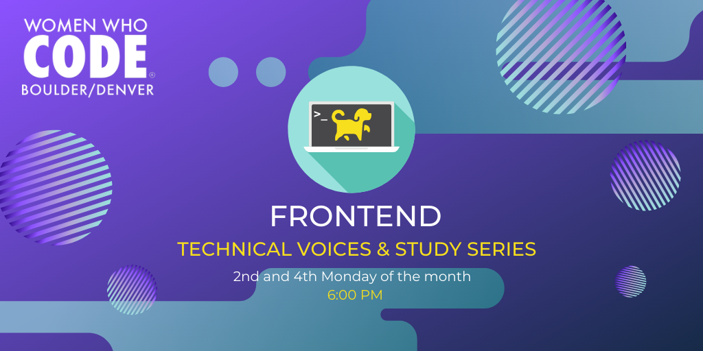

# Frontend Technical Voices Series
Digital space for the WWCode Frontend Technical Voices Series Denver meetup run by @mjordancodes

## 🎉 What this meetup is about
Everyone is welcome, no matter what level. This event will specifically focus on bringing in technical speakers from all over the front end to share knowledge, and stories. The Frontend study series will also include a second monthly event with a more hands-on focus called "Puppies and Portfolios" (More info coming soon!).

## 📅 Find Our Next Event:
Check out our [Meetup page](https://www.meetup.com/Women-Who-Code-Boulder-Denver) for upcoming events. 

# Previous Events
- [Rapid Prototyping and CSS Animation](./previous-events/04-13-2020_rapid-prototyping-and-css-animations.md) | 04/13/2020
