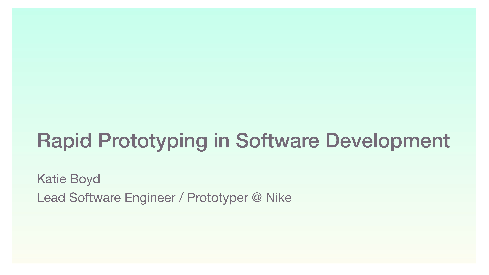

## Frontend Techincal Voices Series: 
# Rapid Prototyping and CSS Animations

**Event Date**: April 13, 2020
 
**Event Location**: Online
 
**Speakers**: [Katie Boyd](https://twitter.com/katrilllion
) and [Jordan Brady](https://twitter.com/mjordancodes)
 
**Meetup Page**: [Meetup.com](https://www.meetup.com/Women-Who-Code-Boulder-Denver/events/269756281/)

---

## ✨ Rapid Prototyping in Software Development ✨
Katie will share a little about her day to day as a Prototyper working at Nike, as well as a few special projects she has worked on.

## 🎙️ About Our Speaker: Katie Boyd
Katie Boyd ([@katrilllion](https://twitter.com/katrilllion)) is a front end developer and prototyper at Nike.

## Related Links
- [Slides](https://app.box.com/s/mtlaj761nns8r2vn5ls4nx4ibm6od1hr)
- [Prototyping Framer/Spotify Video](https://www.youtube.com/watch?v=c46ZtgAdvng)

----

## ✨ A Crash Course in CSS Animations ✨
In this talk you will learn some quick rules and tips about when and how to use CSS Animations. We will review how browsers render HTML/CSS to better understand how we can optimize animations for user delight without slowing down the experience.

## 🎙️ About Our Speaker
Jordan Brady ([@mjordancodes](https://twitter.com/mjordancodes)) is a front end developer at Brandwise, and a new network director for Women Who Code Denver.

## Related Links
- [Slides](https://slides.com/mjordancodes/css-animation/)
- [CodePen Spinning Color Changing Animation](https://codepen.io/mjordancodes/pen/8083e0d81261c352af9bd3d93081f7eb)
- [Article on CSS Aniamtions](https://thoughtbot.com/blog/css-animation-for-beginners)
- [CSS Animation Rocks](https://cssanimation.rocks/)
- [Just-Add-Water CSS Animation Library](https://daneden.github.io/animate.css/)
- [MDN Docs on filer/hue-rotate Properties](https://developer.mozilla.org/en-US/docs/Web/CSS/filter)